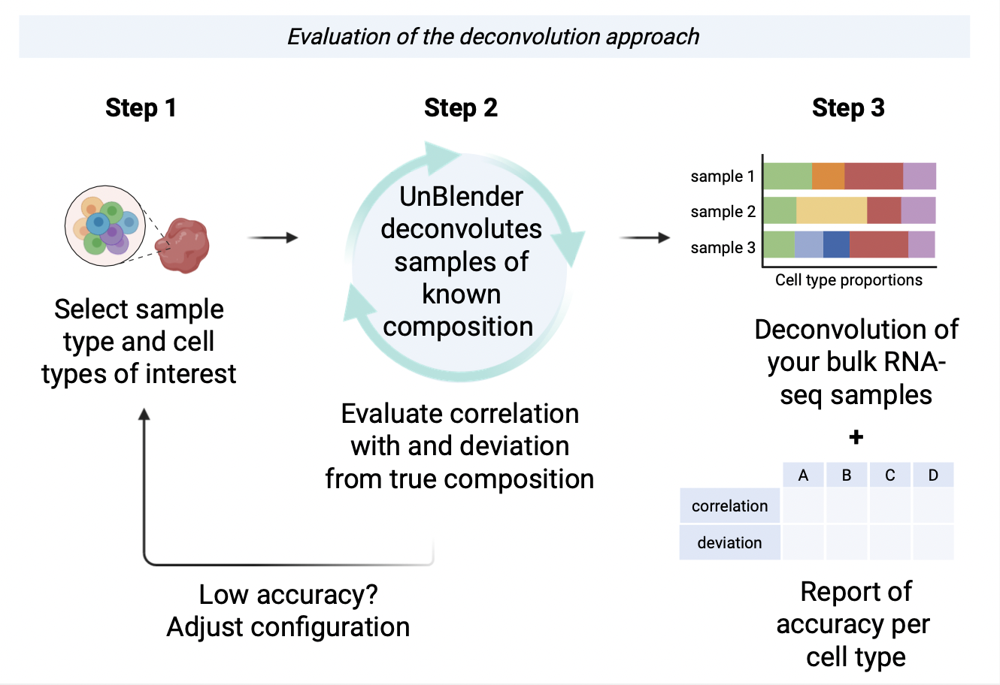

# UnBlender: Reliable Cell Type Deconvolution

UnBlender allows respiratory scientists to perform cell type deconvolution with a custom, validated approach. Not all cell type deconvolution analyses yield reliable results, especially when using highly granular (i.e. high resolution, very specific) cell type labels. UnBlender leverages the Human Lung Cell Atlas [(Sikkema et al., 2023)](https://www.nature.com/articles/s41591-023-02327-2) to deconvolute transcriptomics data into cell type subsets tailored to a research question, and validates whether that approach is able to yield accurate results:


<p align="center">

</p>

**Why is this important?** 
Deconvolution analyses run a very realistic risk of generating meaningless results. For reliable cell type deconvolution, it is essential to test whether the chosen approach is feasible in the sample type.

**How does UnBlender evaluate accuracy?** 
In short: by deconvoluting pseudo-bulk samples with a known cell type composition. More information can be found in [#TODO].

**Which sample types are available?** 
At the moment, UnBlender evaluates deconvolution strategies for nasal brush, bronchial brush, bronchial biopsy and parenchymal resection samples.

------------------------------------------------------------------------

### Graphical user interface

UnBlender will soon be available as an easy to use graphical user
interface (GUI), with a point-and-click menu to configure analysis
parameters. The GUI evaluates the accuracy of the chosen deconvolution
approach, and - if sufficient - deconvolutes the user's transcriptomics
dataset.

Output: 

- A summary of the expected deconvolution accuracy per cell
type: figures and a table to download for inclusion in a manuscript
supplement 
- Deconvolution analysis results of your transcriptomics
dataset

Want to use it now? A beta version of the GUI with full functionality is
available for testers, contact us at
[unblender.info\@gmail.com](mailto:unblender.info@gmail.com) or
submit an issue to this repository.

------------------------------------------------------------------------

### Command line interface

This repository provides a pipeline for the command line interface
(CLI), which evaluates a chosen deconvolution approach and returns:

-   A summary of the expected deconvolution accuracy per cell type:
    figures and a table to download for inclusion in a manuscript
    supplement
-   A signature matrix to use to deconvolute your transcriptomics
    dataset
-   The reference data used to generate the signature matrix

The user can take the signature matrix (or reference data) and perform a
deconvolution analysis on their dataset. The signature matrix can be
saved and shared for future analyses, and easily be incorporated into an
existing workflow using your favourite tool.

------------------------------------------------------------------------

#### How to use the UnBlender CLI

To install:
1)  [Install CIBERSORTx](https://cibersortx.stanford.edu/) (docker)
2)  Download the UnBlender CLI code
3)  [Download the reference data file](https://drive.google.com/drive/folders/1kveolLfL8awEbVrCf86X8ksUH5WEHJ9W?usp=sharing) into the `/source` directory
4)  Install the conda environment: `conda env create -f environment.yml`

To run:
1)  Set up a .yml file to configure your analysis (see details below)
2)  Activate the conda environment: `conda activate UnBlender`
3) Activate the CIBERSORTx docker
4)  ***From the `/source` directory***, run the pipeline using: `snakemake -c1 -q all --configfile my_config_file.yml`

#### Configuring your analysis
You'll need to select the relevant sample type and a set of cell type labels to deconvolute the bulk sample into. Optionally, UnBlender can be set to exclude specific genes from the analysis. This can be useful, e.g. if your phenotype of interest causes altered expression of cell-type-specific genes independently from composition changes. However, removing large numbers of genes is *not* recommended.

An example file (example_config.yaml) is provided which shows how to configure the following:
-   `config_filename`: configuration .yaml file*
-   `sample_type`: `"parenchyma"`, `"bronchial_brush"`, `"nasal_brush"`,
    or `"bronchial_biopsy"`
-   `output_dir`: the output directory*
-   `filter_reference`: `"no_filter"`, or optionally: a text file* containing genes (HGNC names, one per line) to exclude from the analysis
-   `email`: the email address to run CIBERSORTx with
-   `token`: your private CIBERSORTx token
-   `cell_types`: the cell types to deconvolute and matching HLCA annotation level, see below for the correct format. `cell_type_names.tsv` contains an overview of the available cell types.

\* Specify the absolute path

#### Example: cell type selection
The cell type selection to deconvolute into (`cell_types`) should be specified as a nested YAML. The following abridged example shows a deconvolution into three subsets, one of which is composed of **two** cell type labels. Merging cell types into a shared deconvolution subset can be helpful to improve deconvolution accuracy for cell types that have similar transcriptomic profiles. Note the extra dash and indentation.

``` cell_types:
  - - "ann_level_2_clean"
    - "Lymphatic EC"

  - - "ann_level_3_clean" # note the extra dash and indentation:
    - - "Basal"
      - "Secretory"

  - - "ann_level_3_clean"
    - "Multiciliated lineage"
```

------------------------------------------------------------------------

### Citing UnBlender

Have you used UnBlender (GUI or CLI) to perform a cell type
deconvolution analysis? Please cite UnBlender as: [#TODO]

### Questions?

In case of questions, please submit an issue to this repository. 

------------------------------------------------------------------------

###### To do:

Future CLI updates may include: 

- User manual on the UnBlender workflow + tips & tricks (need) 
- Enable signature matrix output with ENSG gene IDs (want) 
- Generalize the pipeline for other reference datasets (want) 
- Add MuSiC deconvolution algorithm option (want)
